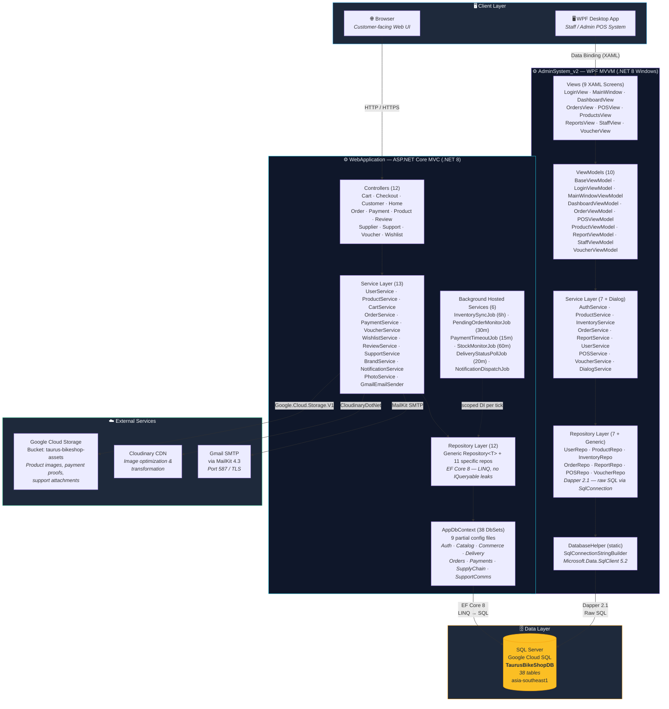
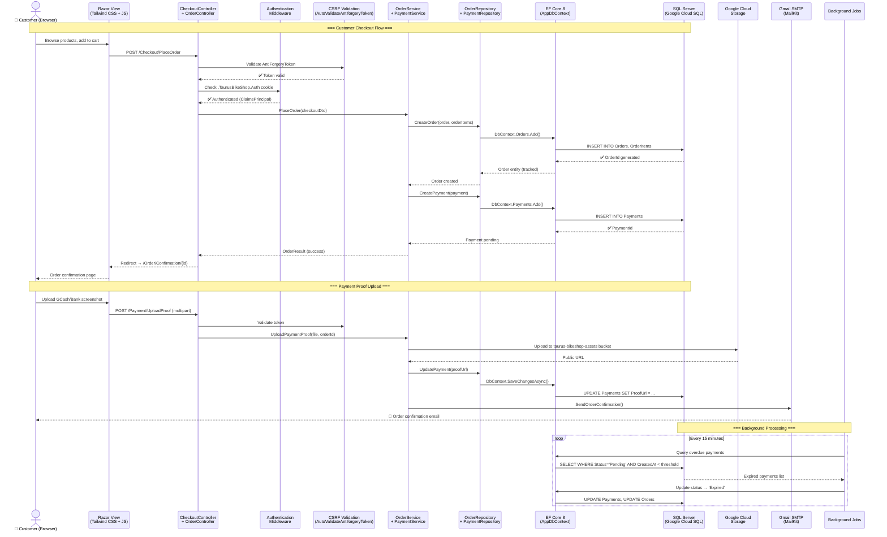
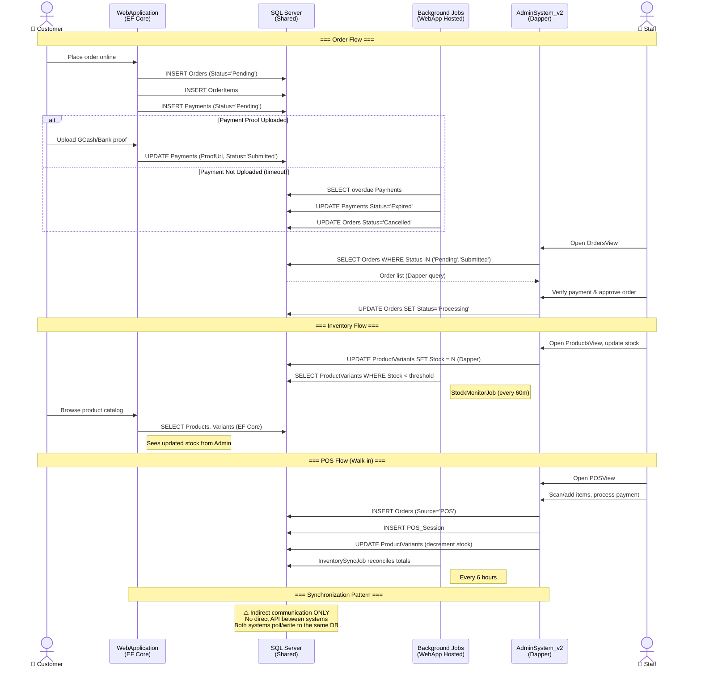
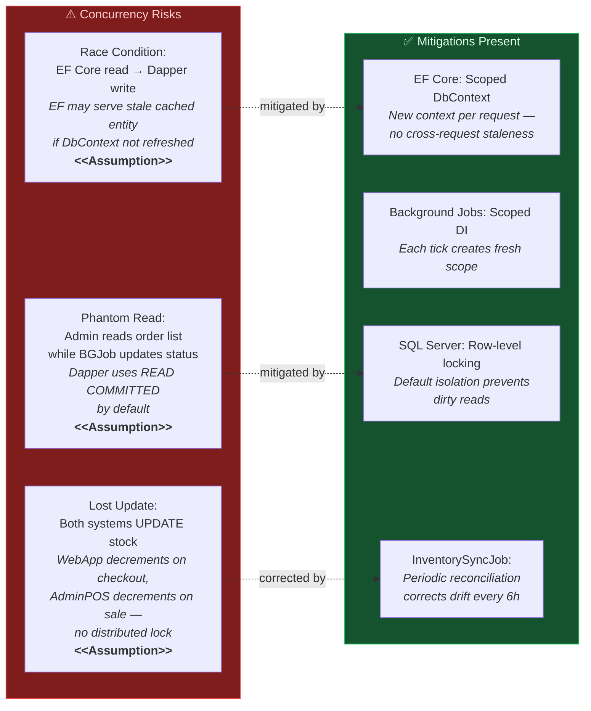
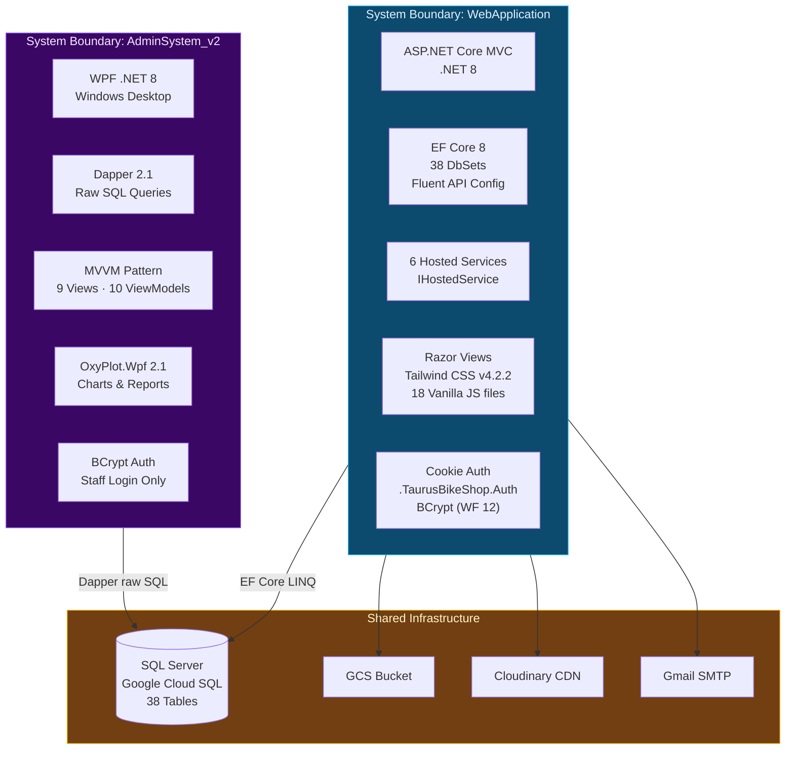

# Taurus Bike Shop — System Architecture

> **Generated from codebase analysis** — All components, layers, and flows reflect the actual project structure as found in the `OOP-TaurusBikeShop` repository. Assumptions are clearly labeled where applicable.

---

## 1. High-Level Architecture Diagram



### Key Architectural Highlights

| Aspect | Detail |
|--------|--------|
| **Shared Database** | Both systems connect to the **same** `TaurusBikeShopDB` on Google Cloud SQL — **no direct API** between them |
| **MVC vs MVVM** | WebApp uses ASP.NET Core MVC (Controller → Service → Repository → EF Core); AdminSystem uses WPF MVVM (View → ViewModel → Service → Repository → Dapper) |
| **Background Services** | 6 `IHostedService` implementations run inside the WebApp process; AdminSystem has **no** background jobs |
| **DI Strategy** | WebApp: built-in ASP.NET Core DI (scoped); AdminSystem: **manual composition** in `App.xaml.cs` (poor-man's DI) |

> [!IMPORTANT]
> There is **no direct API or message queue** between WebApplication and AdminSystem_v2. All integration occurs through the shared SQL Server database. `<<Assumption>>`: No event-driven sync mechanism exists beyond polling via background jobs.

---

## 2. Technical Breakdown

### a. Frameworks & Technologies

| Component | WebApplication | AdminSystem_v2 |
|-----------|---------------|----------------|
| **Framework** | ASP.NET Core MVC | WPF (Windows Presentation Foundation) |
| **Runtime** | .NET 8.0 (LTS) | .NET 8.0 Windows (`net8.0-windows`) |
| **Language** | C# (Nullable enabled, Implicit usings) | C# |
| **Architecture Pattern** | MVC + Repository + Service Layer (3-tier) | MVVM (Model-View-ViewModel) |
| **ORM / Data Access** | Entity Framework Core 8.0.0 | Dapper 2.1.35 |
| **DB Driver** | `Microsoft.EntityFrameworkCore.SqlServer` | `Microsoft.Data.SqlClient 5.2.1` |
| **UI Technology** | Razor Views (`.cshtml`) + Tailwind CSS v4.2.2 + Vanilla JS (18 files) | XAML (9 screens) + WPF value converters |
| **Password Hashing** | BCrypt.Net-Next 4.0.3 (work factor 12) | BCrypt.Net-Next 4.0.3 |
| **Charting** | N/A | OxyPlot.Wpf 2.1.0 |
| **Image CDN** | CloudinaryDotNet 1.28.0 | N/A |
| **File Storage** | Google.Cloud.Storage.V1 4.7.0 | N/A |
| **Email** | MailKit 4.3.0 (Gmail SMTP) | N/A |

---

### b. Entry Points

#### WebApplication

```
Program.cs (Minimal Hosting Model)
├── WebApplicationBuilder
│   ├── Configure HostOptions (BackgroundServiceExceptionBehavior = Ignore)
│   ├── Configure CloudinarySettings & SmtpSettings
│   ├── AddDbContext<AppDbContext> → SQL Server (Google Cloud SQL, retry-on-failure)
│   ├── AddDistributedMemoryCache + AddSession (30min idle timeout)
│   ├── AddAuthentication (CookieAuth: ".TaurusBikeShop.Auth")
│   ├── AddScoped → 12 Repositories + 13 Services
│   ├── AddHostedService → 6 Background Jobs
│   ├── AddControllersWithViews (Global AutoValidateAntiforgeryToken)
│   └── AddCors("CorsPolicy")
│
├── Middleware Pipeline
│   ├── UseExceptionHandler (prod)
│   ├── UseHsts (prod) / UseHttpsRedirection (dev only)
│   ├── UseStaticFiles
│   ├── UseRouting
│   ├── UseCors
│   ├── UseAuthentication
│   ├── UseAuthorization
│   └── UseSession
│
└── MapControllerRoute("{controller=Home}/{action=Index}/{id?}")
```

#### AdminSystem_v2

```
App.xaml / App.xaml.cs
├── OnStartup(StartupEventArgs)
│   ├── Manual Repository instantiation (7 repos)
│   │   UserRepository, ProductRepository, InventoryRepository,
│   │   OrderRepository, ReportRepository, POSRepository, VoucherRepository
│   ├── Manual Service instantiation (8 services + DialogService)
│   │   AuthService, ProductService, InventoryService, OrderService,
│   │   ReportService, UserService, POSService, VoucherService
│   └── ShowLogin() → LoginView
│
├── LoginView.xaml → LoginViewModel
│   └── LoginSucceeded event → ShowMain()
│
└── ShowMain() → MainWindow.xaml (Shell)
    └── MainWindowViewModel (navigation hub)
        ├── DashboardViewModel → DashboardView
        ├── ProductViewModel → ProductsView
        ├── OrderViewModel → OrdersView
        ├── ReportViewModel → ReportsView (OxyPlot charts)
        ├── StaffViewModel → StaffView
        ├── POSViewModel → POSView
        ├── VoucherViewModel → VoucherView
        └── SignOutRequested event → ShowLogin()
```

---

### c. Core Modules (Concrete)

#### WebApplication — Controllers (12)

| Controller | Key Responsibilities |
|------------|---------------------|
| `HomeController` | Landing page, product showcase |
| `CustomerController` | Registration, login, profile, address management |
| `ProductController` | Product catalog browsing, detail view, search/filter |
| `CartController` | Add/remove/update cart items, view cart |
| `CheckoutController` | Address selection, payment method, order placement |
| `OrderController` | Order history, order detail, order tracking |
| `PaymentController` | Payment submission (GCash / Bank Transfer proof upload) |
| `VoucherController` | Voucher application at checkout |
| `WishlistController` | Save/remove wishlist items |
| `ReviewController` | Product reviews and ratings |
| `SupportController` | Support ticket creation and messaging |
| `SupplierController` | Supplier catalog management |

#### WebApplication — Services (13)

| Service | Interface | Purpose |
|---------|-----------|---------|
| `UserService` | `IUserService` | Auth, registration, profile CRUD |
| `ProductService` | `IProductService` | Catalog queries, variant management |
| `BrandService` | `IBrandService` | Brand listing |
| `CartService` | `ICartService` | Cart operations with stock validation |
| `OrderService` | `IOrderService` | Order placement, status tracking, checkout logic |
| `PaymentService` | `IPaymentService` | Payment processing, proof uploads |
| `VoucherService` | `IVoucherService` | Voucher validation and application |
| `WishlistService` | `IWishlistService` | Wishlist management |
| `ReviewService` | `IReviewService` | Review submission and retrieval |
| `SupportService` | `ISupportService` | Ticket lifecycle |
| `NotificationService` | `INotificationService` | In-app notifications |
| `PhotoService` | `IPhotoService` | Cloudinary image upload |
| `GmailEmailSender` | `IEmailSender` | Transactional emails via MailKit |

#### WebApplication — Repositories (12)

| Repository | Data Access | Notes |
|-----------|-------------|-------|
| `Repository<T>` (Generic) | EF Core | Base CRUD via `IRepository<T>` |
| `UserRepository` | EF Core | User lookups, address management |
| `BrandRepository` | EF Core | Brand catalog |
| `CartRepository` | EF Core | Cart items with includes |
| `OrderRepository` | EF Core | Orders with order items, delivery details |
| `PaymentRepository` | EF Core | Payments (GCash, Bank Transfer, polymorphic) |
| `ProductRepository` | EF Core | Products, variants, images |
| `ReviewRepository` | EF Core | Reviews with user data |
| `SupplierRepository` | EF Core | Supplier + purchase order items |
| `SupportRepository` | EF Core | Support tickets + attachments |
| `VoucherRepository` | EF Core | Voucher lookup with usage tracking |
| `WishlistRepository` | EF Core | Wishlist items with product includes |

#### WebApplication — Background Jobs (6 Hosted Services)

| Job | Interval | Purpose |
|-----|----------|---------|
| `InventorySyncJob` | Every 6 hours | Reconcile inventory across systems |
| `PendingOrderMonitorJob` | Every 30 min | Escalate stale pending orders |
| `PaymentTimeoutJob` | Every 15 min | Expire overdue unpaid orders |
| `StockMonitorJob` | Every 60 min | Generate low-stock alerts/notifications |
| `DeliveryStatusPollJob` | Every 20 min | Poll external courier delivery statuses |
| `NotificationDispatchJob` | Event-driven | Dispatch queued user notifications |

#### AdminSystem_v2 — Views (9 XAML Screens)

| View | Purpose |
|------|---------|
| `LoginView` | Staff authentication |
| `MainWindow` | Application shell + sidebar navigation |
| `DashboardView` | KPI cards, inventory overview |
| `POSView` | Point-of-Sale terminal (walk-in customers) |
| `OrdersView` | Online order management, status updates |
| `ProductsView` | Product catalog CRUD |
| `ReportsView` | Sales charts and analytics (OxyPlot) |
| `StaffView` | Staff user management |
| `VoucherView` | Voucher creation and management |

#### AdminSystem_v2 — ViewModels (10)

| ViewModel | Key Bindings |
|-----------|-------------|
| `BaseViewModel` | `INotifyPropertyChanged`, property change helpers |
| `LoginViewModel` | Credentials, `LoginSucceeded` event |
| `MainWindowViewModel` | Navigation state, `SignOutRequested` event, child VM references |
| `DashboardViewModel` | Product counts, low-stock alerts |
| `POSViewModel` | Cart items, customer search, payment processing |
| `OrderViewModel` | Order list, filtering, status updates |
| `ProductViewModel` | Product CRUD, variant management |
| `ReportViewModel` | Date ranges, OxyPlot `PlotModel` generation |
| `StaffViewModel` | Staff list CRUD |
| `VoucherViewModel` | Voucher CRUD, usage stats |

#### AdminSystem_v2 — Services (8 + DialogService)

| Service | Interface | Purpose |
|---------|-----------|---------|
| `AuthService` | `IAuthService` | Staff login validation (BCrypt) |
| `ProductService` | `IProductService` | Product CRUD operations |
| `InventoryService` | `IInventoryService` | Stock level queries |
| `OrderService` | `IOrderService` | Order retrieval and status management |
| `ReportService` | `IReportService` | Sales/inventory report aggregation |
| `UserService` | `IUserService` | Staff account management |
| `POSService` | `IPOSService` | POS transaction processing |
| `VoucherService` | `IVoucherService` | Voucher lifecycle management |
| `DialogService` | `IDialogService` | WPF MessageBox abstraction |

#### AdminSystem_v2 — Repositories (7 + Generic)

| Repository | Data Access | Notes |
|-----------|-------------|-------|
| `Repository` (Generic) | Dapper | Base CRUD via `DatabaseHelper.GetConnection()` |
| `UserRepository` | Dapper | Staff user queries |
| `ProductRepository` | Dapper | Complex product joins with variants/images |
| `InventoryRepository` | Dapper | Stock level queries |
| `OrderRepository` | Dapper | Order aggregation with joins |
| `ReportRepository` | Dapper | Sales summaries, top products, daily breakdowns |
| `POSRepository` | Dapper | POS transaction writes + customer/product lookups |
| `VoucherRepository` | Dapper | Voucher queries with usage stats |

---

## 3. Data Flow Diagram — Web Customer Checkout (End-to-End)



---

## 4. Integration Flow — WebApplication ↔ AdminSystem_v2

```mermaid
graph TD
    subgraph WEB["🌐 WebApplication (EF Core 8)"]
        W_ORDER["OrderService<br/><i>Creates new orders</i>"]
        W_PAYMENT["PaymentService<br/><i>Records customer payments</i>"]
        W_INVENTORY["ProductService<br/><i>Reads inventory for catalog</i>"]
        W_SYNC["InventorySyncJob<br/><i>Every 6h</i>"]
        W_STOCK["StockMonitorJob<br/><i>Every 60m</i>"]
        W_TIMEOUT["PaymentTimeoutJob<br/><i>Every 15m</i>"]
        W_PENDING["PendingOrderMonitorJob<br/><i>Every 30m</i>"]
    end

    subgraph DB_SHARED["🗄️ Shared SQL Server (TaurusBikeShopDB)"]
        T_ORDERS[("Orders<br/>OrderItems")]
        T_PAYMENTS[("Payments<br/>GCashPayment<br/>BankTransferPayment")]
        T_PRODUCTS[("Products<br/>ProductVariants<br/>ProductImages")]
        T_INVENTORY[("InventoryLogs")]
        T_POS[("POS_Session")]
        T_VOUCHERS[("Vouchers<br/>VoucherUsage")]
        T_NOTIFICATIONS[("Notifications")]
    end

    subgraph ADMIN["🖥️ AdminSystem_v2 (Dapper 2.1)"]
        A_POS["POSService<br/><i>Walk-in POS transactions</i>"]
        A_ORDER["OrderService<br/><i>Reads & manages online orders</i>"]
        A_PRODUCT["ProductService<br/><i>CRUD products & stock</i>"]
        A_REPORT["ReportService<br/><i>Sales & inventory reports</i>"]
        A_VOUCHER["VoucherService<br/><i>Create & manage vouchers</i>"]
        A_STAFF["UserService<br/><i>Staff management</i>"]
    end

    %% WebApp writes
    W_ORDER -->|"INSERT<br/>(EF Core)"| T_ORDERS
    W_PAYMENT -->|"INSERT / UPDATE<br/>(EF Core)"| T_PAYMENTS
    W_INVENTORY -->|"SELECT<br/>(EF Core)"| T_PRODUCTS

    %% Background jobs
    W_SYNC -.->|"SELECT / UPDATE<br/>inventory reconciliation"| T_INVENTORY
    W_STOCK -.->|"SELECT<br/>low-stock detection"| T_PRODUCTS
    W_TIMEOUT -.->|"UPDATE<br/>expire overdue"| T_PAYMENTS
    W_TIMEOUT -.->|"UPDATE<br/>cancel expired"| T_ORDERS
    W_PENDING -.->|"SELECT / UPDATE<br/>escalate stale"| T_ORDERS

    %% AdminSystem reads/writes
    A_ORDER -->|"SELECT / UPDATE<br/>(Dapper)"| T_ORDERS
    A_POS -->|"INSERT<br/>(Dapper)"| T_POS
    A_POS -->|"INSERT<br/>(Dapper)"| T_ORDERS
    A_POS -->|"UPDATE<br/>decrement stock (Dapper)"| T_PRODUCTS
    A_PRODUCT -->|"CRUD<br/>(Dapper)"| T_PRODUCTS
    A_REPORT -->|"SELECT aggregates<br/>(Dapper)"| T_ORDERS
    A_REPORT -->|"SELECT aggregates<br/>(Dapper)"| T_PRODUCTS
    A_VOUCHER -->|"CRUD<br/>(Dapper)"| T_VOUCHERS
    A_STAFF -->|"SELECT<br/>(Dapper)"| T_NOTIFICATIONS

    style WEB fill:#0c4a6e,stroke:#38bdf8,color:#e0f2fe
    style ADMIN fill:#3b0764,stroke:#a78bfa,color:#f3e8ff
    style DB_SHARED fill:#713f12,stroke:#fbbf24,color:#fef3c7
```



### Integration Sequence — Order Lifecycle



### Concurrency Considerations



> [!WARNING]
> **`<<Assumption>>`**: Neither system uses explicit **optimistic concurrency tokens** (e.g., `rowversion`/`timestamp` columns) on shared entities like `ProductVariants.Stock`. The `InventorySyncJob` (every 6h) acts as an eventual-consistency reconciliation mechanism, but **real-time stock atomicity is not guaranteed** across the two systems. Under high concurrent load (simultaneous web checkout + POS sale for the same SKU), a race condition could result in overselling.

> [!NOTE]
> **`<<Assumption>>`**: EF Core's change tracker is request-scoped (new `AppDbContext` per HTTP request), so **stale reads within the WebApp** are unlikely. However, between the WebApp and AdminSystem, there is **no cache invalidation** — the AdminSystem always issues fresh Dapper queries, and the WebApp always queries via a new DbContext scope.

---

## 5. System Boundaries Summary



---

## 6. Assumptions Log

| # | Assumption | Impact | Confidence |
|---|-----------|--------|------------|
| 1 | No direct REST API or message queue exists between WebApp and AdminSystem | Core architecture decision — all integration via shared DB | High (verified: no HTTP client or API controllers for cross-system calls found) |
| 2 | No optimistic concurrency tokens (`rowversion`) on shared entities | Stock race conditions possible under high concurrency | Medium (schema files not fully audited for concurrency columns) |
| 3 | AdminSystem uses `READ COMMITTED` isolation (SQL Server default) | Phantom reads unlikely but non-repeatable reads possible within a transaction | High (no explicit isolation level set in Dapper calls) |
| 4 | Background jobs create scoped DI containers per execution tick | Prevents stale DbContext across job iterations | High (verified: ASP.NET Core `IHostedService` with scoped service provider pattern) |
| 5 | AdminSystem has no background thread / polling mechanism | Real-time data refresh requires manual user action (e.g., navigating to a view) | High (no `DispatcherTimer` or background worker found in ViewModels) |
| 6 | Both systems share the same BCrypt work factor (12) for password hashing | Passwords created in one system can be verified in the other | High (both reference `BCrypt.Net-Next 4.0.3`) |
