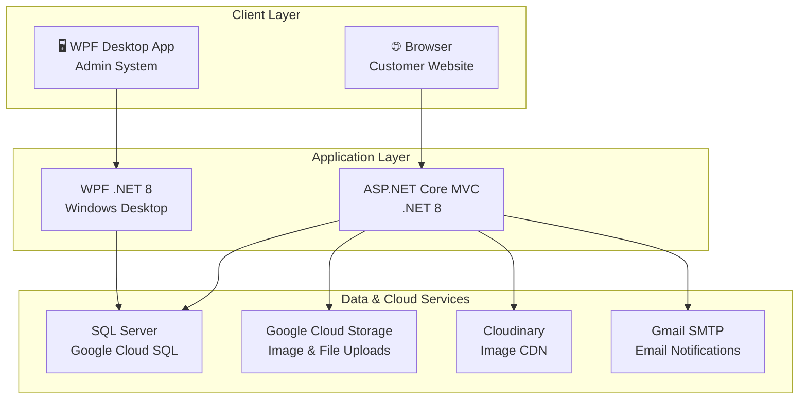

# 🏍️ Taurus Bike Shop — Complete Tech Stack Overview

A **two-application system** for a bike shop e-commerce business. One customer-facing web app and one staff/admin desktop app, sharing a single SQL Server database.

---

## Architecture at a Glance



---

## 1. WebApplication (Customer-Facing Website)

| Attribute | Detail |
|-----------|--------|
| **Framework** | ASP.NET Core MVC |
| **Runtime** | .NET 8.0 (LTS) |
| **Language** | C# (Nullable enabled, Implicit usings enabled) |
| **Architecture** | MVC + Repository + Service Layer (3-tier) |
| **IDE** | Visual Studio 2026 |

### Backend NuGet Packages

| Package | Version | Purpose |
|---------|---------|---------|
| `Microsoft.EntityFrameworkCore.SqlServer` | 8.0.0 | ORM — SQL Server provider for Google Cloud SQL |
| `Microsoft.EntityFrameworkCore.Tools` | 8.0.0 | EF Core design-time tools (migrations, scaffolding) |
| `BCrypt.Net-Next` | 4.0.3 | Password hashing (work factor 12) |
| `Google.Cloud.Storage.V1` | 4.7.0 | Product images & payment proof uploads to GCS |
| `CloudinaryDotNet` | 1.28.0 | Image CDN / transformation |
| `MailKit` | 4.3.0 | SMTP email sending (via Gmail) |

### Data Access

| Component | Technology | Details |
|-----------|-----------|---------|
| **ORM** | Entity Framework Core 8 | Code-first, Fluent API configuration |
| **DbContext** | `AppDbContext.cs` | **38 DbSets**, all relationships via Fluent API |
| **Repository Pattern** | Generic `Repository<T>` | + 11 specific repositories; no `IQueryable` leaks |
| **Migrations** | EF Core Migrations | Schema versioning |

### Frontend Stack

| Component | Technology | Details |
|-----------|-----------|---------|
| **Views** | Razor (`.cshtml`) | Server-rendered MVC views |
| **CSS Framework** | Tailwind CSS v4.2.2 | Compiled via `@tailwindcss/cli` |
| **PostCSS** | v8.5.8 | With `@tailwindcss/postcss` plugin + Autoprefixer |
| **JavaScript** | Vanilla JS | 18 feature-specific JS files (no framework) |
| **AJAX** | `fetchWithCSRF()` helper | Custom utility in `utils.js` |
| **CSS Build** | `npx @tailwindcss/cli` | `npm run build:css` / `npm run watch:css` |

### Frontend File Inventory

**CSS** (2 files):
- `tailwind.css` — source (22 KB)
- `output.css` — compiled output (88 KB)

**JavaScript** (18 files):
`app.js`, `cart.js`, `checkout.js`, `confirmation.js`, `customer.js`, `dashboard.js`, `index.js`, `order-history.js`, `order.js`, `payment.js`, `product-catalog.js`, `product.js`, `review.js`, `site.js`, `support.js`, `utils.js`, `voucher.js`, `wishlist.js`

### Controllers (12)

`CartController`, `CheckoutController`, `CustomerController`, `HomeController`, `OrderController`, `PaymentController`, `ProductController`, `ReviewController`, `SupplierController`, `SupportController`, `VoucherController`, `WishlistController`

### Background Jobs (6 Hosted Services)

| Job | Interval | Purpose |
|-----|----------|---------|
| `InventorySyncJob` | Every 6h | Inventory synchronization |
| `PendingOrderMonitorJob` | Every 30min | Monitor/escalate pending orders |
| `PaymentTimeoutJob` | Every 15min | Expire overdue payments |
| `StockMonitorJob` | Every 60min | Low-stock alerts |
| `DeliveryStatusPollJob` | Every 20min | Poll courier delivery statuses |
| `NotificationDispatchJob` | — | Dispatch queued notifications |

> [!NOTE]
> All background jobs use `HostOptions.BackgroundServiceExceptionBehavior = Ignore` so failures don't crash the host.

### Authentication & Session

| Feature | Implementation |
|---------|---------------|
| **Auth** | Cookie-based authentication (`.TaurusBikeShop.Auth`) |
| **Session** | Server-side session (`.TaurusBikeShop.Session`, 30min idle timeout) |
| **Password Hashing** | BCrypt (work factor 12) via `PasswordHelper` |
| **CSRF Protection** | `[ValidateAntiForgeryToken]` on all POST actions |

---

## 2. AdminSystem_v2 (Staff/Admin Desktop App)

| Attribute | Detail |
|-----------|--------|
| **Framework** | WPF (Windows Presentation Foundation) |
| **Runtime** | .NET 8.0 Windows (`net8.0-windows`) |
| **Language** | C# |
| **Architecture** | MVVM (Model-View-ViewModel) |
| **Data Access** | Dapper (micro-ORM) + raw SQL |

### NuGet Packages

| Package | Version | Purpose |
|---------|---------|---------|
| `Microsoft.Data.SqlClient` | 5.2.1 | SQL Server database connectivity |
| `Dapper` | 2.1.35 | Lightweight micro-ORM for queries |
| `BCrypt.Net-Next` | 4.0.3 | Password hashing (shared with Web) |
| `Microsoft.Extensions.Configuration` | 8.0.0 | Configuration framework |
| `Microsoft.Extensions.Configuration.Json` | 8.0.0 | `appsettings.json` support |
| `Microsoft.Extensions.Configuration.EnvironmentVariables` | 8.0.0 | Environment variable config |
| `Microsoft.Extensions.Configuration.UserSecrets` | 8.0.0 | Secret management (dev-time) |
| `OxyPlot.Wpf` | 2.1.0 | Data charting and report visualizations |
| `ClosedXML` | 0.102.3 | Excel report generation / export |

### Admin Views (12 XAML screens)

`LoginView`, `MainWindow`, `DashboardView`, `OrdersView`, `POSView`, `ProductsView`, `ReportsView`, `StaffView`, `VoucherView`, `CredentialDialog`, `StorePaymentAccountView`, `SupportTicketsView`

### MVVM Components

| Layer | Directory | Purpose |
|-------|-----------|---------|
| **Models** | `Models/` | 30 entity/DTO classes + POS-specific models |
| **ViewModels** | `ViewModels/` | UI state + commands |
| **Views** | `Views/` | 9 XAML screens |
| **Repositories** | `Repositories/` | Data access via Dapper |
| **Services** | `Services/` | Business logic |
| **Helpers** | `Helpers/` | Utility classes |
| **Converters** | `Converters/` | WPF value converters |

---

## 3. Database

| Attribute | Detail |
|-----------|--------|
| **Engine** | Microsoft SQL Server (2019+ dialect) |
| **Hosting** | Google Cloud SQL for SQL Server |
| **Instance** | `taurus-bike-shop-sqlserver:asia-southeast1:taurus-bike-shop-sqlserver-2026` |
| **Database Name** | `TaurusBikeShopDB` |
| **Schema Version** | v8.2.0 (latest), with v8.0 and v8.1 history |
| **Schema Size** | ~145–257 KB per version (comprehensive) |
| **Tables** | **38 entities** mapped via EF Core |

### Key Entity Groups

| Domain | Entities |
|--------|----------|
| **Users & Auth** | User, Address (with snapshots) |
| **Catalog** | Product, ProductVariant, ProductImage, Brand, Category, PriceHistory |
| **Cart & Wishlist** | CartItem, Wishlist items |
| **Orders** | Order, OrderItem |
| **Payments** | Payment, GCashPayment, BankTransferPayment |
| **Delivery** | DeliveryDetail, LalamoveDelivery, LBCDelivery, PickupOrder |
| **Inventory** | InventoryLog (append-only), PurchaseOrderItem |
| **Promotions** | Voucher, VoucherUsage |
| **Support** | SupportTicket, attachments |
| **POS** | POS_Session |
| **System** | SystemLog, Notifications |

---

## 4. Cloud & External Services

| Service | Provider | Purpose |
|---------|----------|---------|
| **Database Hosting** | Google Cloud SQL | Managed SQL Server instance (asia-southeast1) |
| **File Storage** | Google Cloud Storage | Bucket: `taurus-bikeshop-assets` — product images, payment proofs, support attachments |
| **Image CDN** | Cloudinary | Image optimization & transformation |
| **Email** | Gmail SMTP (via MailKit) | Transactional emails (port 587, TLS) |
| **Deployment (planned)** | Azure App Service | Production hosting for ASP.NET Core + Azure SQL |
| **Source Control** | GitHub | `butterkookies/OOP-TaurusBikeShop` |

---

## 5. DevOps & Tooling

### Containerization

| Component | Detail |
|-----------|--------|
| **Dockerfile** | Multi-stage build (`sdk:8.0` → `aspnet:8.0`) |
| **Exposed Port** | 8080 |
| **Runtime** | Docker Desktop (optional, WSL 2 backend) |

### Build & Package Management

| Tool | Purpose |
|------|---------|
| **npm / Node.js** | Tailwind CSS compilation pipeline |
| **NuGet** | .NET package management |
| **MSBuild** | .NET project builds via Visual Studio |
| **PostCSS** | CSS transformations (autoprefixer + Tailwind) |

### npm Scripts

```json
{
  "build:css": "npx @tailwindcss/cli -i ./WebApplication/wwwroot/css/tailwind.css -o ./WebApplication/wwwroot/css/output.css --minify",
  "watch:css": "npx @tailwindcss/cli -i ./WebApplication/wwwroot/css/tailwind.css -o ./WebApplication/wwwroot/css/output.css --watch"
}
```

### npm Dependencies

| Package | Version | Type |
|---------|---------|------|
| `@mermaid-js/mermaid-cli` | ^11.12.0 | Dependency (diagram generation) |
| `tailwindcss` | ^4.2.2 | Dev dependency |
| `@tailwindcss/postcss` | ^4.2.2 | Dev dependency |
| `postcss` | ^8.5.8 | Dev dependency |
| `autoprefixer` | ^10.4.27 | Dev dependency |

### Secret Management

- **User Secrets** — Connection strings, API keys, SMTP credentials stored via `dotnet user-secrets`
- **UserSecretsId (Web)**: `fbe64185-b3a5-41ff-9715-6b03fc7c1472`
- **UserSecretsId (Admin)**: `adminsystem-v2-taurus`

---

## 6. Development Tools

| Tool | Purpose |
|------|---------|
| **Visual Studio 2022** | Primary IDE (ASP.NET + WPF workloads) |
| **.NET 8 SDK** | Runtime & compiler |
| **SQL Server Express** | Local database (dev) |
| **SSMS** | Database management GUI |
| **Git** | Version control |
| **GitHub** | Remote repository |
| **Postman** | API testing |
| **Docker Desktop** | Containerization (optional) |
| **Figma** | UI/UX wireframes |
| **Draw.io** | ERD, architecture, flowcharts |
| **Mermaid CLI** | Diagram-as-code generation |

---

## 7. Tech Stack Summary Table

| Layer | WebApplication | AdminSystem |
|-------|---------------|-------------|
| **Language** | C# (.NET 8) | C# (.NET 8 Windows) |
| **UI Framework** | Razor + Tailwind CSS v4 + Vanilla JS | WPF (XAML) |
| **Architecture** | MVC + Service + Repository | MVVM |
| **ORM / Data Access** | EF Core 8 | Dapper 2.1 |
| **Database** | SQL Server (Google Cloud SQL) | SQL Server (Google Cloud SQL) |
| **Auth** | Cookie-based + BCrypt | BCrypt |
| **File Uploads** | GCS + Cloudinary | N/A |
| **Email** | MailKit (Gmail SMTP) | N/A |
| **Charts** | N/A | OxyPlot.Wpf |
| **Deployment** | Docker / Azure (planned) | Desktop installer |
| **CSS Tooling** | Tailwind v4 + PostCSS + Autoprefixer | N/A |
