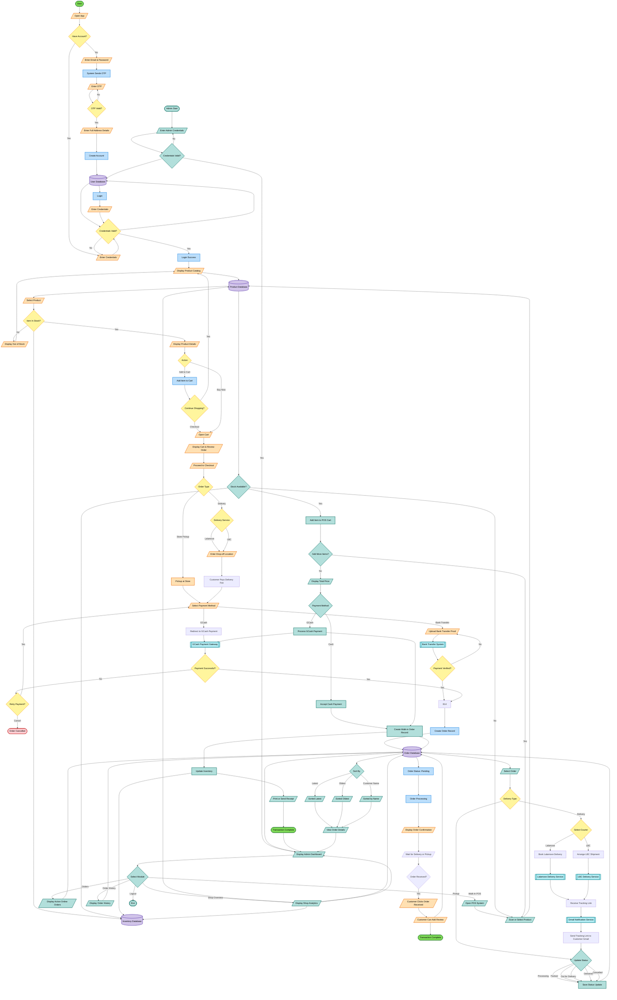

```mermaid
flowchart TD

%% =========================
%% DATABASES / EXTERNAL
%% =========================

DB1[(User Database)]
DB2[(Product Database)]
DB3[(Order Database)]
DB4[(Inventory Database)]

EXT1[[GCash Payment Gateway]]
EXT2[[Lalamove Delivery Service]]
EXT3[[LBC Delivery Service]]
EXT4[[Gmail Notification Service]]
EXT5[[Bank Transfer System]]

%% =========================
%% USER JOURNEY (ONLINE)
%% =========================

A0([Start]) --> A1[/Open App/]

A1 --> A2{Have Account?}

%% SIGNUP
A2 -->|No| A3[/Enter Email & Password/]
A3 --> A4[System Sends OTP]
A4 --> A5[/Enter OTP/]
A5 --> A6{OTP Valid?}

A6 -->|No| A5
A6 -->|Yes| A6A[/Enter Full Address Details/]
A6A --> A7[Create Account]

A7 --> DB1
DB1 --> A8[Login]

%% LOGIN
A2 -->|Yes| A9[/Enter Credentials/]

A8 --> A10[/Enter Credentials/]
A9 --> A11{Credentials Valid?}

A11 --> DB1
DB1 --> A11

A10 --> A11

A11 -->|No| A9
A11 -->|Yes| A12[Login Success]

%% SHOPPING
A12 --> B1[/Display Product Catalog/]
B1 --> DB2
DB2 --> B2[/Select Product/]

B2 --> BINV{Item In Stock?}
BINV --> DB4

BINV -->|No| OUT[/Display Out of Stock/]
OUT --> B1

BINV -->|Yes| B3[/Display Product Details/]

B3 --> B4{Action}

B4 -->|Add to Cart| B5[Add Item to Cart]
B5 --> B6{Continue Shopping?}

B6 -->|Yes| B1
B6 -->|Checkout| B7[/Open Cart/]

B4 -->|Buy Now| B7

%% CHECKOUT
B7 --> B8[/Display Cart & Review Order/]
B8 --> B9[/Proceed to Checkout/]

%% DELIVERY OPTION
B9 --> B20{Order Type}

B20 -->|Store Pickup| B21[Pickup at Store]

B20 -->|Delivery| B22{Delivery Service}

B22 -->|Lalamove| B23[/Enter Drop-off Location/]
B22 -->|LBC| B23

B23 --> B24[Customer Pays Delivery Fee]

B21 --> B10
B24 --> B10

%% PAYMENT TYPES (ONLINE)
B10[/Select Payment Method/]

B10 -->|GCash| B11[Redirect to GCash Payment]
B11 --> EXT1
EXT1 --> B12{Payment Successful?}

B10 -->|Bank Transfer| B29[/Upload Bank Transfer Proof/]
B29 --> EXT5
EXT5 --> B30{Payment Verified?}

B30 -->|No| B29
B30 -->|Yes| B14

B12 -->|No| B13{Retry Payment?}
B13 -->|Yes| B10
B13 -->|Cancel| Z1([Order Cancelled])

B12 -->|Yes| B14

%% ORDER PROCESS
B14 --> B15[Create Order Record]
B15 --> DB3

DB3 --> B16[Order Status: Pending]

B16 --> B17[Order Processing]
B17 --> B18[/Display Order Confirmation/]

B18 --> B19[/Wait for Delivery or Pickup/]

B19 --> B25{Order Received?}

B25 -->|Yes| B26[/Customer Clicks Order Received/]
B26 --> B27[/Customer Can Add Review/]

B27 --> DB3
B27 --> B28([Transaction Complete])

%% =========================
%% ADMIN JOURNEY
%% =========================

C0([Admin Start]) --> C1[/Enter Admin Credentials/]

C1 --> C2{Credentials Valid?}
C2 --> DB1

C2 -->|No| C1
C2 -->|Yes| C3[/Display Admin Dashboard/]

C3 --> C4{Select Module}

C4 -->|Orders| D1
C4 -->|Walk-In POS| W1
C4 -->|Order History| E1
C4 -->|Shop Overview| F1
C4 -->|Logout| C5([End])

%% =========================
%% ONLINE ORDERS MANAGEMENT
%% =========================

D1[/Display Active Online Orders/]
D1 --> DB3
DB3 --> D2[/Select Order/]

D2 --> D5{Delivery Type}

%% PICKUP FLOW
D5 -->|Pickup| D3

%% DELIVERY FLOW
D5 -->|Delivery| D6{Select Courier}

D6 -->|Lalamove| D7[Book Lalamove Delivery]
D7 --> EXT2

D6 -->|LBC| D8[Arrange LBC Shipment]
D8 --> EXT3

EXT2 --> D9[Receive Tracking Link]
EXT3 --> D9

D9 --> EXT4
EXT4 --> D10[Send Tracking Link to Customer Gmail]

D10 --> D3

%% STATUS UPDATE
D3{Update Status}

D3 -->|Processing| D4
D3 -->|Packed| D4
D3 -->|Out for Delivery| D4
D3 -->|Delivered| D4
D3 -->|Cancelled| D4

D4[Save Status Update]
D4 --> DB3
DB3 --> C3

%% =========================
%% WALK-IN CUSTOMER POS
%% =========================

W1[/Open POS System/]

W1 --> W2[/Scan or Select Product/]
W2 --> DB2

DB2 --> W3{Stock Available?}
W3 --> DB4

W3 -->|No| W2

W3 -->|Yes| W4[Add Item to POS Cart]

W4 --> W5{Add More Items?}

W5 -->|Yes| W2
W5 -->|No| W6[/Display Total Price/]

%% WALK-IN PAYMENT
W6 --> W7{Payment Method}

W7 -->|Cash| W8[Accept Cash Payment]

W7 -->|GCash| W9[Process GCash Payment]
W9 --> EXT1

W8 --> W10[Create Walk-in Order Record]
W9 --> W10

W10 --> DB3

W10 --> W11[Update Inventory]
W11 --> DB4

W11 --> W12[/Print or Send Receipt/]

W12 --> W13([Transaction Complete])

W13 --> C3

%% =========================
%% ORDER HISTORY
%% =========================

E1[/Display Order History/]
E1 --> DB3
DB3 --> E2{Sort By}

E2 -->|Latest| E3[/Sorted Latest/]
E2 -->|Oldest| E4[/Sorted Oldest/]
E2 -->|Customer Name| E5[/Sorted by Name/]

E3 --> E6[/View Order Details/]
E4 --> E6
E5 --> E6

E6 --> C3

%% =========================
%% SHOP OVERVIEW
%% =========================

F1[/Display Shop Analytics/]
F1 --> DB2
F1 --> DB3
F1 --> DB4
F1 --> C3

%% =========================
%% COLOR DEFINITIONS
%% =========================

classDef startend fill:#7ED957,stroke:#2E7D32,stroke-width:2px,color:#000
classDef process fill:#BBDEFB,stroke:#1E88E5,stroke-width:2px,color:#000
classDef decision fill:#FFF59D,stroke:#F9A825,stroke-width:2px,color:#000
classDef io fill:#FFE0B2,stroke:#EF6C00,stroke-width:2px,color:#000
classDef database fill:#D1C4E9,stroke:#512DA8,stroke-width:2px,color:#000
classDef external fill:#B2EBF2,stroke:#00838F,stroke-width:2px,color:#000
classDef cancel fill:#FFCDD2,stroke:#C62828,stroke-width:2px,color:#000
classDef admin fill:#B2DFDB,stroke:#00695C,stroke-width:2px,color:#000

%% =========================
%% CLASS ASSIGNMENTS
%% =========================

class A0,B28,C0,C5,W13 startend
class Z1 cancel

class A4,A7,A8,A12,B5,B15,B16,B17,D4,W4,W10,W11 process

class A2,A6,A11,B4,B6,B12,B13,C2,D3,E2,BINV,B20,B22,W3,W5,W7,D5,D6,B30 decision

class A1,A3,A5,A9,A10,A6A,B1,B2,B3,B7,B8,B9,B10,B18,B21,B23,C1,C3,D1,D2,E1,E3,E4,E5,E6,F1,OUT,W1,W2,W6,W12,B26,B27,B29 io

class DB1,DB2,DB3,DB4 database
class EXT1,EXT2,EXT3,EXT4,EXT5 external

class C0,C1,C2,C3,C4,C5,D1,D2,D3,D4,E1,E2,E3,E4,E5,E6,F1,W1,W2,W3,W4,W5,W6,W7,W8,W9,W10,W11,W12 admin
```
