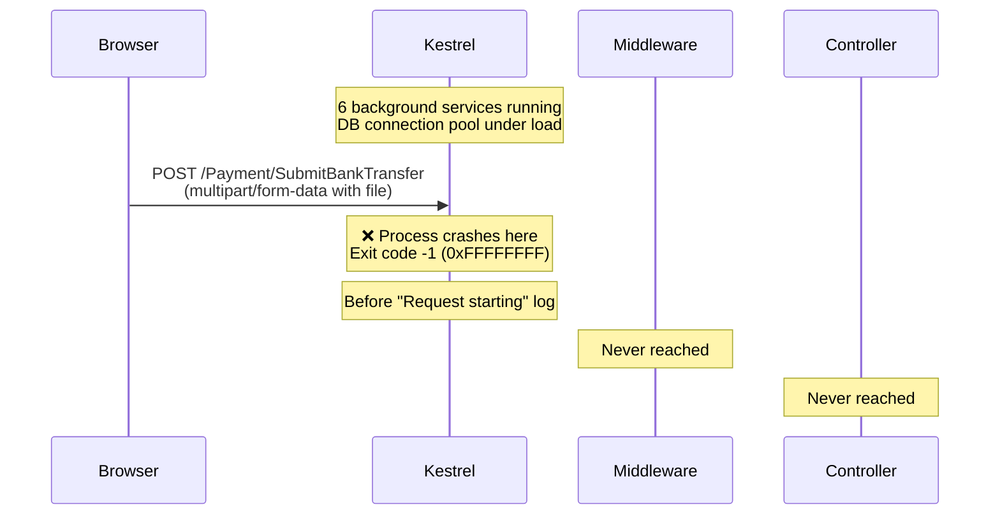

# Root Cause Analysis — Payment Proof Submission Crash

## Summary

The application **process crashes with exit code -1 (0xFFFFFFFF)** when the user submits proof of payment. The POST request to `/Payment/SubmitGCash` or `/Payment/SubmitBankTransfer` **never reaches the ASP.NET Core logging middleware** — the process dies before the request is even logged.

---

## Evidence Timeline (from `web-app-error.md`)

| Log Line | Event | Status |
|----------|-------|--------|
| 1–2 | **GCS unavailable** — credentials not found | ⚠️ Warning |
| 1099–1235 | `POST /Checkout/PlaceOrder` → Order #15 created (BankTransfer, Pickup) | ✅ OK |
| 1237–1332 | `GET /Order/Confirmation?orderId=15` → Confirmation page renders | ✅ OK |
| 1395–1495 | `GET /Payment/Submit?orderId=15` → **Payment page renders successfully** | ✅ OK |
| 1506–1548 | Normal post-load activity (NotificationCount, CartCount, InventorySyncJob) | ✅ OK |
| 1550 | **`WebApplication.exe exited with code -1`** | ❌ CRASH |

> [!CAUTION]
> **There is NO `POST /Payment/SubmitGCash` or `POST /Payment/SubmitBankTransfer` anywhere in the log.** The process terminates before ASP.NET Core's `HostingDiagnostics` middleware can even write the "Request starting" log entry.

---

## Root Cause

### Primary Cause: Fatal process termination during multipart form POST arrival

The crash occurs with **exit code -1** (uncatchable fatal error) and **zero error output** — no exception, no stack trace, no error-level log. This rules out any application-level exception, because the entire call chain has comprehensive try/catch coverage:

```
Payment.cshtml form.submit()
  → PaymentController.SubmitGCash/SubmitBankTransfer (try/catch)
    → PaymentService.Submit*Async (try/catch + InvalidOperationException catch)
      → PhotoService.UploadPaymentProofAsync (try/catch with local fallback)
```

**None of this code was ever reached.** The crash occurs at the **Kestrel HTTP server level** during initial processing of the incoming multipart/form-data POST request, before the middleware pipeline is entered.

### Contributing Factors

#### 1. Heavy concurrent resource pressure from 6 background hosted services

Six `BackgroundService` instances run simultaneously, all creating scoped `DbContext` instances and executing queries:

| Job | Frequency | Last activity before crash |
|-----|-----------|--------------------------|
| `InventorySyncJob` | Every 10s | **Line 1545–1548** (last log before crash) |
| `StockMonitorJob` | Continuous | Lines 267–386 (multiple sequential queries) |
| `PaymentTimeoutJob` | Every 5 min | Lines 309–322 |
| `PendingOrderMonitorJob` | Periodic | Line 33–34 |
| `DeliveryStatusPollJob` | Periodic | Lines 39–40, 178–192 |
| `NotificationDispatchJob` | Periodic | Lines 41–42, 304–307 |

At the moment of crash, these jobs are actively consuming DB connections and application memory.

#### 2. MARS (Multiple Active Result Sets) warnings

```
warn: Microsoft.EntityFrameworkCore.Database.Transaction[30004]
      Savepoints are disabled because Multiple Active Result Sets (MARS) is enabled.
```

This warning appears **6 times** during the checkout flow (lines 1153–1208). MARS allows multiple open result sets per SQL connection, which reduces connection pool consumption but adds memory overhead per connection and increases deadlock risk.

#### 3. Upload storage chain has dual-unused dependencies

The system has **two** file upload pathways registered in DI, creating unnecessary complexity:

| Component | Backed By | Status at Runtime |
|-----------|-----------|-------------------|
| `FileUploadHelper` | Google Cloud Storage | Registered as **`null!`** ([Program.cs:155-156](file:///c:/Users/Brian/OOP-TaurusBikeShop/WebApplication/Program.cs#L155-L156)) |
| `PhotoService` (`IPhotoService`) | Cloudinary → Local fallback | **Cloudinary disabled** (credentials are placeholders) |

- **GCS**: `StorageClient.Create()` fails → `FileUploadHelper` is registered as `null!`
- **Cloudinary**: `ApiKey` and `ApiSecret` are `"SET_VIA_USER_SECRETS_OR_ENVIRONMENT_VARIABLE"` in [appsettings.json:43-44](file:///c:/Users/Brian/OOP-TaurusBikeShop/WebApplication/appsettings.json#L43-L44) → `PhotoService` detects this and sets `_cloudinary = null`
- **Actual upload path**: Falls back to `SaveLocallyAsync()` → saves to `wwwroot/uploads/`

While the `PhotoService` fallback logic is correct, the payment submission POST **never gets far enough to execute it**.

---

## Crash Mechanism



The exit code `-1` (0xFFFFFFFF) in .NET indicates an **unrecoverable fatal error** that bypasses all managed exception handling. Common causes:
- `OutOfMemoryException` (cannot allocate buffers for the multipart body)
- `StackOverflowException`
- Native code crash in an unmanaged dependency
- CLR `Environment.FailFast()`

Given the concurrent load from 6 background services + the multipart file upload arriving simultaneously, **memory pressure / resource exhaustion** is the most likely trigger.

---

## Key Source Files Examined

| File | Role | Finding |
|------|------|---------|
| [PaymentController.cs](file:///c:/Users/Brian/OOP-TaurusBikeShop/WebApplication/Controllers/PaymentController.cs) | POST handlers for GCash/BankTransfer | Full try/catch coverage — **never reached** |
| [PaymentService.cs](file:///c:/Users/Brian/OOP-TaurusBikeShop/WebApplication/BusinessLogic/Services/PaymentService.cs) | Upload + DB logic | Full try/catch coverage — **never reached** |
| [PhotoService.cs](file:///c:/Users/Brian/OOP-TaurusBikeShop/WebApplication/BusinessLogic/Services/PhotoService.cs) | Cloudinary → local fallback | Fallback is correct — **never reached** |
| [Program.cs](file:///c:/Users/Brian/OOP-TaurusBikeShop/WebApplication/Program.cs#L120-L157) | GCS/Cloudinary DI setup | GCS=`null!`, Cloudinary=disabled |
| [Payment.cshtml](file:///c:/Users/Brian/OOP-TaurusBikeShop/WebApplication/Views/Customer/Payment.cshtml) | Form + JS confirmation modal | Form submits correctly via `pendingForm.submit()` |
| [InventorySyncJob.cs](file:///c:/Users/Brian/OOP-TaurusBikeShop/WebApplication/BackgroundJobs/InventorySyncJob.cs) | Last job running before crash | Queries DB every 10s — consuming connections |

---

## Recommended Fix Direction

> [!IMPORTANT]
> The fix should address **why the process crashes fatally** when receiving a multipart POST under concurrent background service load. This is NOT a simple bug in the payment submission code — that code was never reached.

1. **Reduce background service concurrency** — 6 hosted services each polling the DB is excessive for a single-process app. Consider consolidating or staggering them.

2. **Add connection pool monitoring** — The default SQL Server connection pool size is 100. With 6 background services + web requests, pool exhaustion is plausible.

3. **Configure Kestrel request limits explicitly** — Add `MaxConcurrentConnections` and memory buffer limits to prevent resource exhaustion during file uploads.

4. **Test the file upload in isolation** — Stop all background services and retry the payment submission to confirm whether the crash is caused by the upload itself or by the concurrent load.

5. **Enable Windows Event Viewer / dump collection** — Since the crash produces no .NET logs, a native crash dump would reveal the exact cause (OOM, stack overflow, native exception).
